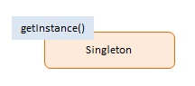

# JavaScript Singleton (Một lớp mà chỉ có một thể hiện duy nhất có thể tồn tại)

> Singleton pattern giới hạn số lượng **phiên bản** của một đối tượng cụ thể chỉ là một.

## Using Singleton

- Mục tiêu của Singleton pattern là đảm bảo rằng một lớp chỉ có một thể hiện (đối tượng) duy nhất và cung cấp một điểm truy cập toàn cục đến thể hiện này.
  + Singleton làm giảm nhu cầu về các biến toàn cục, điều này đặc biệt quan trọng trong JavaScript vì nó hạn chế ô nhiễm không gian tên và nguy cơ xung đột tên liên quan.
  + Một số mẫu khác, chẳng hạn như `Factory`, `Prototype` và `Façade` thường được triển khai dưới dạng Singleton khi chỉ cần một phiên bản.

## Diagram

;

## Participants

**Singleton** (`Singleton`)

- Định nghĩa getInstance() trả về phiên bản duy nhất.
- Chịu trách nhiệm tạo và quản lý đối tượng instance.

```js
var Singleton = (function () {
  var instance;

  function createInstance() {
    var object = new Object("I am the instance");
    return object;
  }

  return {
    getInstance: function () {
      if (!instance) {
        instance = createInstance();
      }
      return instance;
    },
  };
})();

function run() {
  var instance1 = Singleton.getInstance();
  var instance2 = Singleton.getInstance();
  console.log("Same instance? " + (instance1 === instance2));
}
```
> Một ví dụ điển hình về việc sử dụng `Singleton` là trong trường hợp của một lớp quản lý tài nguyên chung như cơ sở dữ liệu kết nối, nhật ký (log), hoặc cấu hình ứng dụng.
