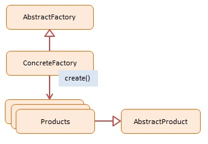

# JavaScript Abstract Factory (Tạo một thể hiện của một số họ đối tượng liên quan)

> Mục tiêu chính của `Abstract Factory` pattern là cung cấp một giao diện (interface) để tạo ra các họ đối tượng liên quan hoặc các đối tượng có liên quan mà không cần chỉ định lớp cụ thể của chúng.

## Using Abstract Factory

- `Abstract Factory` pattern cho phép bạn tạo ra các hệ thống đối tượng có tính tương thích, bằng cách đảm bảo rằng các đối tượng được tạo ra từ cùng một `Abstract Factory` sẽ tương thích với nhau
- Nó cung cấp một cách để đóng gói việc tạo đối tượng và giúp tránh sự phụ thuộc vào các lớp cụ thể của đối tượng.

> Khi sử dụng `Abstract Factory` pattern, bạn không cần phải biết cụ thể về cách tạo từng đối tượng UI trong client code. Thay vào đó, bạn sử dụng phương thức được cung cấp bởi `Abstract Factory` để tạo ra các đối tượng mà bạn cần, và cách chúng được tạo ra là trách nhiệm của các Concrete Factory.

## Diagram

;

## Participants

**AbstractFactory** -- not used in JavaScript

- declares an interface for creating products

**ConcreteFactory** -- In example code: `EmployeeFactory`, `VendorFactory`

- a factory object that 'manufactures' new products
- the create() method returns new products

**Products** -- In example code: `Employee`, `Vendor`

- the product instances being created by the factory

**AbstractProduct** -- not used in JavaScript

- declares an interface for the products that are being created

```js
nction Employee(name) {
	this.name = name;
	this.say = function () {
			console.log("I am employee " + name);
	};
}

function EmployeeFactory() {
	this.create = function (name) {
			return new Employee(name);
	};
}

function Vendor(name) {
	this.name = name;
	this.say = function () {
			console.log("I am vendor " + name);
	};
}

function VendorFactory() {
	this.create = function (name) {
			return new Vendor(name);
	};
}

function run() {
	var persons = [];
	var employeeFactory = new EmployeeFactory();
	var vendorFactory = new VendorFactory();

	persons.push(employeeFactory.create("Joan DiSilva"));
	persons.push(employeeFactory.create("Tim O'Neill"));
	persons.push(vendorFactory.create("Gerald Watson"));
	persons.push(vendorFactory.create("Nicole McNight"));

	for (var i = 0, len = persons.length; i < len; i++) {
			persons[i].say();
	}
}
```
