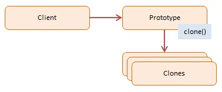

# Prototype (Một phiên bản được khởi tạo đầy đủ để được sao chép hoặc nhân bản)

> The Prototype Pattern tạo ra các objects, nhưng thay vì tạo new objects, nó trả về các objects được khởi tạo với các thuộc tính và phương phức có sẵn của từ object nguyên mẫu.

## Using Prototype

- Mục tiêu của Prototype pattern là tạo ra các đối tượng mới bằng cách sao chép (clone) một đối tượng hiện có thay vì tạo mới đối tượng từ đầu. Điều này giúp giảm thiểu sự kết nối chặt chẽ với lớp cụ thể của đối tượng mà bạn muốn tạo ra.
- Các ngôn ngữ cổ điển hiếm khi sử dụng Prototype pattern, nhưng JavaScript là ngôn ngữ nguyên mẫu, sử dụng mẫu này trong việc xây dựng các objects mới và prototypes của chúng.

## Diagram

;

## Participants

- Client -- In example code: the run() function.
  creates a new object by asking a prototype to clone itself

- Prototype -- In example code: CustomerPrototype
  creates an interfaces to clone itself

- Clones -- In example code: Customer
  the cloned objects that are being created

```js
function CustomerPrototype(proto) {
  this.proto = proto;

  this.clone = function () {
    var customer = new Customer();

    customer.first = proto.first;
    customer.last = proto.last;
    customer.status = proto.status;

    return customer;
  };
}

function Customer(first, last, status) {
  this.first = first;
  this.last = last;
  this.status = status;

  this.say = function () {
    console.log(
      "name: " + this.first + " " + this.last + ", status: " + this.status
    );
  };
}

function run() {
  var proto = new Customer("n/a", "n/a", "pending");
  var prototype = new CustomerPrototype(proto);

  var customer = prototype.clone();
  customer.say();
}
```
