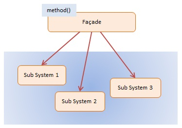

# Façade Pattern

> A single class that represents an entire subsystem

- Façade cung cấp giao diện bảo vệ máy khách khỏi chức năng phức tạp trong một hoặc nhiều hệ thống con. 
- Đó là một simple pattern có vẻ tầm thường nhưng nó rất mạnh mẽ và cực kỳ hữu ích. 
- Nó thường hiện diện trong các hệ thống được xây dựng xung quanh kiến ​​trúc nhiều lớp.

> Phía sau một hệ thống phức tạp, là một giao diện đơn giản cho người dùng

## Diagram



## Participants

Façade -- In example code: `Mortgage`
- knows which subsystems are responsible for a request
- delegates client requests to appropriate subsystem objects

Sub Systems -- In example code: `Bank`, `Credit`, `Background`
- implements and performs specialized subsystem functionality
- have no knowledge of or reference to the façade

## Using Façade

- Mục đích của Façade là cung cấp giao diện cấp cao (thuộc tính và phương thức) giúp hệ thống con hoặc bộ công cụ dễ sử dụng cho khách hàng.

```js
var Mortgage = function (name) {
    this.name = name;
}

Mortgage.prototype = {

    applyFor: function (amount) {
        // access multiple subsystems...
        var result = "approved";
        if (!new Bank().verify(this.name, amount)) {
            result = "denied";
        } else if (!new Credit().get(this.name)) {
            result = "denied";
        } else if (!new Background().check(this.name)) {
            result = "denied";
        }
        return this.name + " has been " + result +
            " for a " + amount + " mortgage";
    }
}

var Bank = function () {
    this.verify = function (name, amount) {
        // complex logic ...
        return true;
    }
}

var Credit = function () {
    this.get = function (name) {
        // complex logic ...
        return true;
    }
}

var Background = function () {
    this.check = function (name) {
        // complex logic ...
        return true;
    }
}

function run() {
    var mortgage = new Mortgage("Joan Templeton");
    var result = mortgage.applyFor("$100,000");

    console.log(result);
}
```