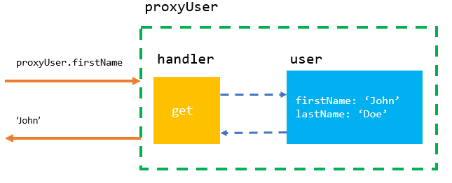

# Proxy Pattern

- Với một đối tượng Proxy, chúng ta có nhiều quyền kiểm soát hơn, đối với các tương tác với các đối tượng. 
- Một đối tượng proxy có thể xác định hành vi bất kì khi nào chúng ta tương tác với đối tượng, chẳng hạn như khi chúng ta nhận một giá trị hoặc đặt một giá trị.

> Nói chung, proxy có nghĩa là người thay thế cho người khác. Thay vì nói chuyện trực tiếp với người đó, bạn sẽ nói chuyện với người được ủy quyền, người sẽ đại diện cho người mà bạn đang cố gắng tiếp cận. Điều tương tự cũng xảy ra trong JavaScript: thay vì tương tác trực tiếp với đối tượng đích, chúng ta sẽ tương tác với đối tượng Proxy (như một middleware).



## Reactivity

- `Reactivity` (tạm dịch là tính phản ứng) là khả năng của một ứng dụng hoặc framework để theo dõi và phản ứng lại các thay đổi trong dữ liệu và tự động cập nhật giao diện người dùng để phản ánh các thay đổi đó. Điều này đặc biệt hữu ích trong việc xây dựng các ứng dụng động, nơi dữ liệu thay đổi liên tục.

Ví dụ, trong một ứng dụng web, nếu người dùng thay đổi dữ liệu trong một trường nhập liệu, chúng ta muốn ứng dụng phản ứng lại bằng cách cập nhật các giá trị tương ứng trên giao diện người dùng.

- `Proxy` không phải là một tính năng của Javascript cung cấp sẵn để hỗ trợ reactivity. Tuy nhiên, chúng ta có thể sử dụng Proxy để tạo ra một giải pháp reactivity tùy chỉnh cho ứng dụng của mình. Khi sử dụng Proxy để tạo ra reactivity, chúng ta phải tự tay theo dõi các thay đổi trong dữ liệu và phản ứng lại chúng, thay vì sử dụng một giải pháp reactivity được xây dựng sẵn như trong Vue hoặc React.

> Để tóm lại, reactivity là khả năng của một ứng dụng để phản ứng lại các thay đổi trong dữ liệu và tự động cập nhật giao diện người dùng để phản ánh các thay đổi đó. Proxy không phải là một giải pháp reactivity được xây dựng sẵn, tuy nhiên chúng ta có thể sử dụng nó để tạo ra một giải pháp reactivity tùy chỉnh cho ứng dụng của mình.

> **Proxy không phải là một đối tượng của reactivity**

## Trap

- `Trap` là một thuộc tính của đối tượng Proxy, được sử dụng để định nghĩa các hành vi tùy chỉnh cho các thao tác truy cập vào đối tượng được bao bọc bởi Proxy.

- Cụ thể, mỗi trap là một hàm tùy chỉnh được định nghĩa bởi người lập trình và được gọi khi có các thao tác nhất định được thực hiện trên đối tượng Proxy.

- Dưới đây là một số trap phổ biến trong TypeScript và chúng được sử dụng như thế nào:
  - `get(): any`: được gọi khi một thuộc tính của đối tượng Proxy được truy cập.
  - `set(): boolean`: được gọi khi một giá trị được gán cho thuộc tính của đối tượng Proxy.
  - `apply(): any`: được gọi khi một phương thức của đối tượng Proxy được gọi.
  - `construct(): object`: được gọi khi đối tượng Proxy được khởi tạo như một đối tượng khởi tạo.

> Proxy trong TypeScript `có thể theo dõi và phát hiện các thay đổi của đối tượng bên trong nó`thông qua các trap (fuction handlers) như get(), set(), deleteProperty(), apply(), v.v. Các trap này được gọi mỗi khi một hành động cụ thể được thực hiện trên đối tượng, như truy cập thuộc tính, thay đổi giá trị của thuộc tính, xóa thuộc tính, gọi phương thức, v.v.

## Cách dùng 

### Validation

```js
const proxyHandler = {
    get: (obj, prop) => {
      console.log(`The value of ${prop} is ${obj[prop]}`);
    },
    set: (obj, prop, value) => {
      console.log(`Changed ${prop} from ${obj[prop]} to ${value}`);
      obj[prop] = value;
    },
  }

const person = {
    name: "John Doe",
    age: 42,
    nationality: "American",
};
   
const personProxy = new Proxy(person, proxyHandler);
personProxy.name;
personProxy.age = 43;

// The value of name is John Doe
// Changed age from 42 to 43
```

- Một proxy có thể hữu ích để thêm `validation`. Người dùng không thể thay đổi tuổi của một người thành giá trị chuỗi hoặc đặt tên trống cho họ. Hoặc nếu người dùng đang cố truy cập một thuộc tính trên đối tượng không tồn tại, chúng ta nên thông báo cho người dùng biết.

```js
const personProxy = new Proxy(person, {
  get: (obj, prop) => {
    if (!obj[prop]) {
      console.log(
        `Hmm.. this property doesn't seem to exist on the target object`
      );
    } else {
      console.log(`The value of ${prop} is ${obj[prop]}`);
    }
  },
  set: (obj, prop, value) => {
    if (prop === "age" && typeof value !== "number") {
      console.log(`Sorry, you can only pass numeric values for age.`);
    } else if (prop === "name" && value.length < 2) {
      console.log(`You need to provide a valid name.`);
    } else {
      console.log(`Changed ${prop} from ${obj[prop]} to ${value}.`);
      obj[prop] = value;
    }
  },
});


personProxy.nonExistentProperty;
personProxy.age = "44";
personProxy.name = "";

// Hmm.. this property doesn't seem to exist on the target object
// Sorry, you can only pass numeric values for age.
// You need to provide a valid name.
```

### Theo dõi và kiểm soát các thao tác truy cập vào các thuộc tính của một đối tượng

```ts
interface Person {
  firstName: string;
  lastName: string;
}

const person: Person = {
  firstName: "John",
  lastName: "Doe",
};

const personProxy = new Proxy(person, {
  get(target: Person, property: string): any {
    console.log(`Getting ${property}`);
    return target[property];
  },
  set(target: Person, property: string, value: any): boolean {
    console.log(`Setting ${property} to ${value}`);
    target[property] = value;
    return true;
  },
});

const firstName = personProxy.firstName; // Logs: "Getting firstName"
const firstNameChange = personProxy.firstName = "Jane"; // Logs: "Setting firstName to Jane"

console.log(person); // Change origin object

console.log(firstName); // John
console.log(firstNameChange); // Jane
```

## Có thể biến đổi các giá trị được trả về bởi các phương thức của đối tượng.

```ts
class Person {
  private name: string;
  public age: number;

  constructor(name: string, age: number) {
    this.name = name;
    this.age = age;
  }
  getName() {
    return this.name;
  }
}

const person = new Person("John", 24);
const proxy = new Proxy(person, {
  get(target, prop) {
    console.log(target) // Person { name: 'John' }
    console.log(prop) // getName
    if (prop === "getName") {
      return function () {
        return `Mr. ${target.getName()}`;
      };
    }
    return target[prop];
  },
});

console.log(proxy.getName()); // "Mr. John"
console.log(proxy.age); // 24
```

## Reflect

- JavaScript cung cấp sẵn một đối tượng có tên là Reflect, giúp chúng ta thao tác với đối tượng mục tiêu dễ dàng hơn khi làm việc với proxy.

> Instead of accessing properties through `obj[prop]` or setting properties through `obj[prop] = value`, we can access or modify properties on the target object through `Reflect.get()` and `Reflect.set()`. The methods receive the same arguments as the methods on the handler object.

```js
const personProxy = new Proxy(person, {
  get: (obj, prop) => {
    console.log(`The value of ${prop} is ${Reflect.get(obj, prop)}`);
  },
  set: (obj, prop, value) => {
    console.log(`Changed ${prop} from ${obj[prop]} to ${value}`);
    Reflect.set(obj, prop, value);
  },
});
```

<https://dev.to/devishraq/understanding-javascript-proxies-harnessing-the-power-of-metaprogramming-1l4d>