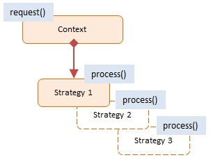

# Strategy Pattern

> Encapsulates an algorithm inside a class

- `Strategy Pattern` (Mẫu chiến lược) là một mẫu thiết kế trong lập trình hướng đối tượng (Object-Oriented Programming - OOP).

- Mục đích của nó là cho phép bạn xác định một loạt các thuật toán hoặc chiến lược khác nhau và làm cho chúng có thể `thay thế cho nhau` mà `không cần thay đổi cấu trúc` của lớp chứa chúng.

> Điều này giúp giảm thiểu sự phụ thuộc giữa các lớp và tạo ra sự linh hoạt trong việc chọn các chiến lược thích hợp cho một tình huống cụ thể.

## Diagram

;

## Using Strategy

```JS
// Bước 1: Tạo các chiến lược (các strategies)
class PayByCreditCard {
  pay(amount) {
    console.log(`Paid $${amount} by credit card`);
  }
}

class PayByPayPal {
  pay(amount) {
    console.log(`Paid $${amount} by PayPal`);
  }
}

class PayByCash {
  pay(amount) {
    console.log(`Paid $${amount} in cash`);
  }
}

// Bước 2: Tạo lớp chứa chiến lược và sử dụng nó (Context)
class ShoppingCart {
  constructor(paymentStrategy) {
    this.paymentStrategy = paymentStrategy;
    this.items = [];
  }

  addItem(item) {
    this.items.push(item);
  }

  calculateTotal() {
    return this.items.reduce((total, item) => total + item.price, 0);
  }

  checkout() {
    const totalAmount = this.calculateTotal();
    this.paymentStrategy.pay(totalAmount);
  }
}

// Bước 3: Sử dụng chiến lược
const cart = new ShoppingCart(new PayByCreditCard());

cart.addItem({ name: 'Item 1', price: 50 });
cart.addItem({ name: 'Item 2', price: 30 });

cart.checkout();
```
Trong ví dụ trên, chúng ta đã tạo ba chiến lược khác nhau để thanh toán (`PayByCreditCard`, `PayByPayPal` và `PayByCash`). Một đối tượng ShoppingCart có khả năng chọn một trong các chiến lược này để thanh toán đơn hàng. Điều này cho phép chúng ta thay đổi phương thức thanh toán mà không cần thay đổi mã nguồn của lớp ShoppingCart.