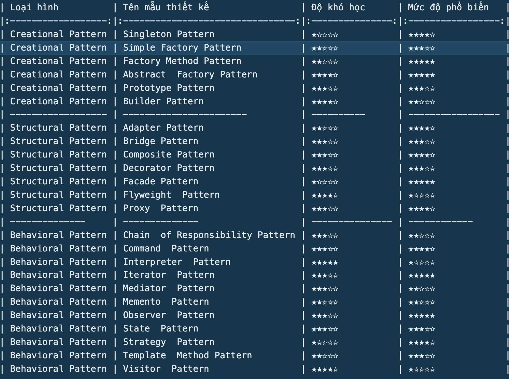

# Javascript Pattern

- https://www.patterns.dev/
- https://www.dofactory.com/javascript/design-patterns

> Ngôn ngữ lập trình đều có những sai sót vốn có của nó, nên những lập trình đã tìm kím và đúc kết ra `những giải pháp chung` đã chứng minh được qua những thành công trước đó, đó chính là Design Pattern.

- Trong số 23 Design pattern, có: 
    + 5 Design pattern sáng tạo (Creational pattern)
    + 7 Design pattern cấu trúc (Stuctural Pattern)
    + 11 Design pattern hành vi (Behavioral Pattern)

## Design Pattern là gì?

- Các mẫu thiết kế đến từ kinh nghiệm và trí tuệ của nhiều chuyên gia lập trình
- Học các mẫu thiết kế giúp hiểu sâu hơn về tư duy hướng đối tượng

- Các điểm cần nắm khi học design pattern
    + Mục đích của mẫu thiết kế dùng để làm gì?
    + Giải quyết vấn đề gì?
    + Sử dụng nó khi nào?

- Cách tốt nhất để trải nghiệm là SỬ DỤNG chúng

- Không lạm dụng các pattern, không cố gắng sử dụng tất cả pattern trong một hệ thống

## 23 mẫu design pattern

